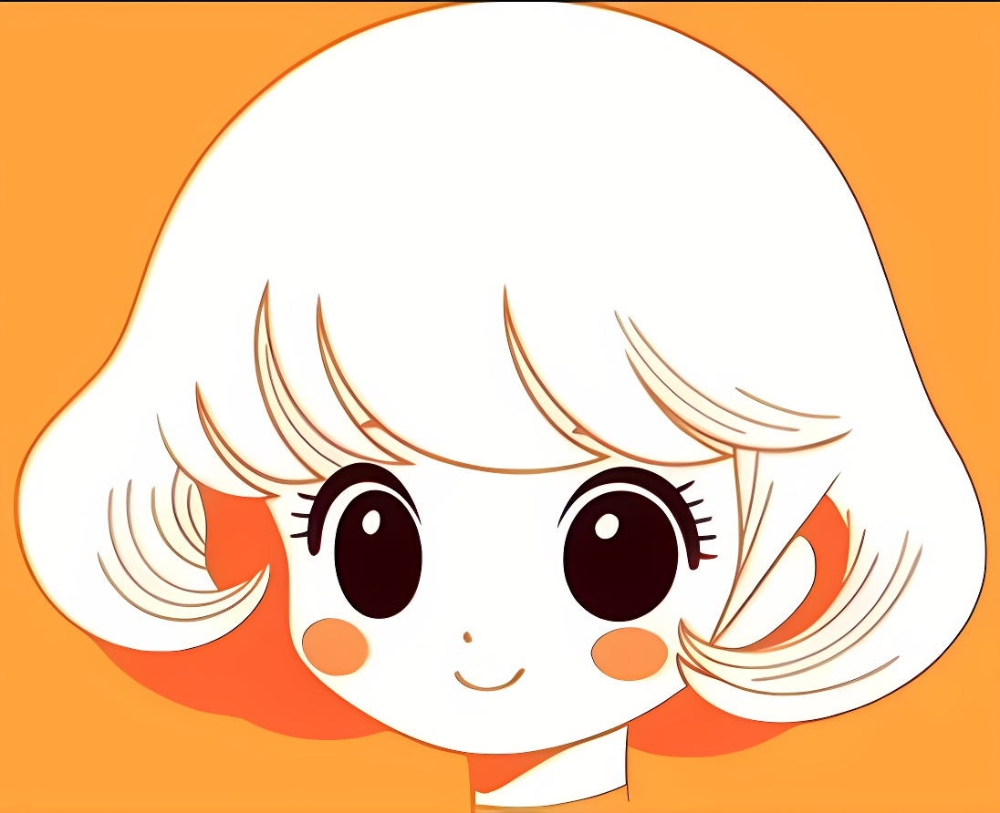

[Midjourney](https://www.midjourney.com/)

私信Midjourney Bot：这样就没有其它人打搅

第一行的前4个按钮 U1 U2 U3 U4 功能是将图片放大
- vary(region) 局部重绘，自己选择重绘区域

第二行的4个按钮V1 V2 V3 V4 功能是对所选图片进行微整

# MJ prompts 构成： 风格 + 场景描述 
```prompts
(复古吉卜力风格)Retro Ghibli style, 拍摄角度 + 。。。场景描述。。。 + (角色设计图)character sheet , (白色背景)white background,  (让日式动漫风格更强烈) --niji 5
```
例如：
```
低角度、前视角，在19世纪的英国牧场，一个年轻的女孩拿着柳条篮，羊在背景中吃草，清晨，清澈的蓝天
```
low-angle, front view of a young girl in a 19th-century English pasture holding a wicker basket, sheep grazing in the background, early morning, clear blue sky

<pre style="white-space: pre-wrap; word-wrap: break-word;">
Retro Ghibli style,low-angle, front view of a young girl in a 19th-century English pasture holding a wicker basket, sheep grazing in the background, early morning, clear blue sky white background,  --niji 5
</pre>

# AI制作漫画最大的挑战：维持角色外观的一致性 `consistent style`
[使用这个B站视频提到的办法](https://www.bilibili.com/video/BV13u4y1r75u/?spm_id_from=333.337.search-card.all.click&vd_source=d1bae303e273c3b02ddcd7baf6b6a596)

### 优先使用这个方法： 在正常prompts 后面加 --sref 图片在MJ的url地址(可以多张)
在正常prompts 后面加 `--sref 一张图片在MJ的url地址`, MJ就会参考这张图片的风格、生成吻合内容(包括：风格、构图、颜色、光效、颜色。。。)
- `--sref`只在 v6 和 niji v6 及以上版本可用
- `--sref` 是 style references 风格参考的意思
- `--sref` 后面可以跟多张图片的url， 关键是用**空格来分隔**url。如：`--sref url1  url2`
  - 如果`--sref`后面跟了多个图的url，那么可以用` ::数字`，来声明每张图对结果的影响。如`--sref url1 ::5 url2 ::2`
- 后面还可以再加`--sw 数字` 控制所生成内容和原图的匹配程度，取值范围是`0--1000`。 数字越大，参考图对结果影响就越大；简单说就是值越大就越像。

例子：
1. 先在MJ上传这张图片, 并获取它在MJ的URL地址



2. 在`--sref`参数后面附上这张图片的URL，生成和这张照片风格一致的内容
```
a cute girl --niji 6 --sref https://s.mj.run/ZJzkg7D9pOA
```


3. 还可生成同样风格的其它动物，比如，狗
```
cute cat --niji 6 --sref https://s.mj.run/ZJzkg7D9pOA
```


### Pan 平移： 让画布朝上下、左右4个方向进行延伸
在延伸画布时，会参考本张画布原有的内容， 从而人物和服饰就会维持一致的风格。

- `/settings`调出MJ的设定面板, 选中`Remix mode`混合模式。 这样在选择Pan按钮进行延伸的时候，可以额外加入自己的prompts提示词进行干预。
- 在弹出的prompts输入框加入 **character sheet**角色设计图。 以及加入自己需要的promts， 比如添加多视角，人物不同的表情或动作。
  - full body 全身
  - turnaround 多视角
  - different expressions 不同表情

### 把预先上传到MJ的图片地址，放在提示词prompts前面， MJ就会生成吻合这些图片的东西

- 先把一些图片上传到MJ, 拷贝这些图片的MJ地址，一行一个。
- 然后把这些图片地址放在提示词prompts前面，MJ就会生成吻合这些图片的东东。

例如：
<pre style="white-space: pre-wrap; word-wrap: break-word;">
图片在MJ的地址url1
图片在MJ的地址url2
。。。
图片在MJ的地址urln
Retro Ghibli style,low-angle, front view of a young girl in a 19th-century English pasture holding a wicker basket, sheep grazing in the background, early morning, clear blue sky white background,  --niji 5
</pre>

### 先用普通提示词生成图片， 然后再通过`vary(region) 局部重绘`进行替换
- `/settings`调出MJ的设定面板, 选中`Remix mode`混合模式。这样就可以额外加入自己的prompts提示词进行干预。
- 先用普通提示词生成图片， 选择`vary(region) 局部重绘`，选择需要重绘区域。
- 在提示词前面加入**图片在MJ的地址url**， 这样就会用这张图片对应的部分，对所选区域进行重绘。
例如：
<pre style="white-space: pre-wrap; word-wrap: break-word;">
图片在MJ的地址url
Retro Ghibli style,low-angle, front view of a young girl in a 19th-century English pasture holding a wicker basket, sheep grazing in the background, early morning, clear blue sky white background,  --niji 5
</pre>

