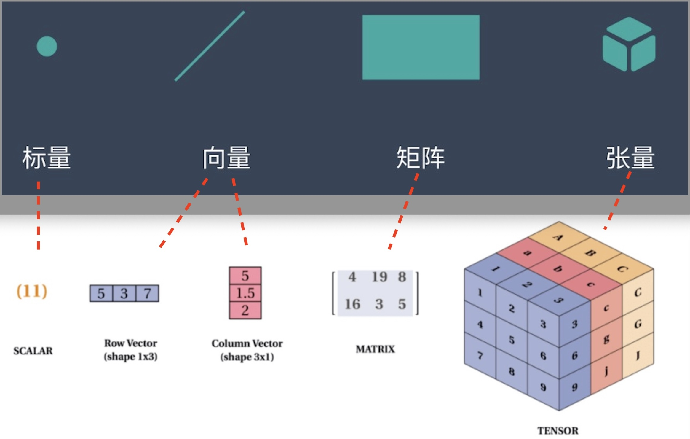

Mojo是第一个专门为MLIR设计的语言，它不仅要成为**Python的超集**，而且是一门**追求极致性能的系统编程语言（Focused on performance & system programming)**。 Mojo寻求尽可能高的性能，以消除两个世界的问题（Python为了提高性能，很多性能敏感的库只能使用C或C++来编写）；Mojo直接编译为原生机器代码，没有用C作为中间代码。

- Python是动态、强类型的**解释型语言**。内存管理机制是：引入计数、**垃圾回收**、内存池机制。
- **Mojo**是静态、强类型、**内存安全memory safety**的**编译型**语言。 它没有使用引用计数和垃圾收集器来管理内存。而是像Rust一样，通过**定义`对象的生命周期`，使用`借用检查器`来`自动管理内存`**。

为什么Mojo成为Python的超集可以实现？ Chris Lattner 是LLVM、Clang、Swift、MLIR的作者。
- Clang编译器（C、C++、Objective-C、CUDA、OpenCL等编译器）是GCC、MSVC和其他现有编译器的“兼容替代品”。Clang编译器要兼容这些的复杂性比实现Mojo兼容Python大一个数量级。

- Swift拥抱了Objective-C运行时和语言生态系统， 通过Swift，Chris Lattner 具备保持“运行时兼容”以及如何与遗留运行时合作的丰富经验。

期待有这么一天：CPython团队最终用Mojo语言而不是C语言实现解释器 🔥 。 （Python官方的解释器实现用C语言实现的，所以也叫**CPython**，它是最广泛使用的Python解释器）

> MLIR多级中间表示（Multi-Level Intermediate Representation ）是编程语言(如mojo）或者库（如 TensorFlow）和机器代码之间的中间语言，允许不同语言的不同编译器堆栈之间的代码重用以及其他性能和可用性优势。 

# Python 和 Mojo 的区别
- 在Python中，引用无处不在（名称就是引用，列表/元组中的元素都是引用，函数参数作为引用传递）
<br>
- **Python对象的可不可变`在于它们的类型`**：list列表可变， 元组tuple不可变。
```python
tup1 = ('physics', 'chemistry', 1997, 2000)  # 元组不可变
list1 = [3,7,'Mar','Feb','Jan']              # 列表可变
```
- 类似于其他静态语言，**Mojo对象的可不可变不在于类型，而在于是用`let`还是`var`来声明的**。例如，即使Mojo 的字符串本质上是可改动的, 也可以用像 `let s = String("Mojo")` 这样的语法声明一个不可改动的字符串。

# 关键字`alias` 定义编译时常数
```mojo
alias PI = 3.141592653589793
alias TAU = 2 * PI
```


# Parametric 编译时参数 & Argument 运行时参数
**Parametric参数** 要求放在**方夸号里`[ ]`**，它的值要求是在编译时是已知的，所以也叫**编译时参数**。
**Argument参数** 要求放在**括号里`( )`**，它的值要求是在运行时是已知的，所以也叫**运行时参数**。

### Parametric 编译时参数的 Fully-bound partially-bound unbound types

Parametric编译时参数 支持部分绑定partially bound， 例如，添加了一个新的 Scalar 类型别名，定义为：
```mojo
alias Scalar = SIMD[size=1]
```

# 内存管理  & value ownership 所有权
所有现代编程语言都将数据存储在两个地方之一：`call stack调用栈`和 `heap堆`，有时也用`CPU registers寄存器`存取数据。然而，每种语言读取和写入数据的方式略有不同-有时非常不同

### stack栈 & 存储空间固定的局部变量
一般来说，所有编程语言都以相同的方式使用`call stack调用栈`：当调用函数时，编译器在栈上分配一个内存块，该内存块的大小正好是`存储执行逻辑` 和 **`存储空间固定的局部变量(fixed-size local values)所需的大小`**。当另一个函数被调用时，它的数据同样被添加到栈的顶部。当一个函数完成时，它在栈中的所有数据都将被销毁，以便内存可用于其他代码。


### heap堆 & 动态改变存储空间的值
请注意，我们说只有 **存储空间固定的局部变量(fixed-size local values)** 存储在栈stack中。任何在运行时可以 **`动态改变存储空间的值(dynamically-sized values)`** 都存储在堆heap中，堆是一个更大的内存区域，允许在运行时进行动态内存访问。

此外，需要在函数的生存期之外生存的值，也存储在heap堆中。即使创建它的函数运行结束，从堆栈中移除之后，这些head堆上分配的值，也还在，这是发生大多数内存错误的地方，也是不同编程语言之间内存管理策略差异最大的地方。因为内存是有限的，所以程序尽快从heap堆中删除未使用的数据（“释放”内存）是很重要的。

### 垃圾收集器 GC & 手动内存管理
一些编程语言试图通过使用**垃圾收集器**来隐藏内存管理的复杂性，**该进程跟踪所有内存使用情况并定期释放未使用的堆内存**（也称为自动内存管理）。好处是，它减轻了开发人员手动内存管理的负担，可以避免错误，提高开发效率。但是，**GC会影响性能**，因为垃圾收集器会中断程序的执行，造成程序卡顿，并且可能不会很快回收内存，导致内存用量增加。

其他语言要求您**手动释放在堆上分配的数据**。然而，这种方法很**容易出错**，特别是当程序的多个部分需要访问同一块内存时，很难知道程序的哪个部分拥有该数据，并负责释放数据。程序员可能会在程序完成之前意外地释放数据，导致**释放后使用 use-after-free**的错误，或者它们可能释放它两次，导致**双重释放double free**错误，或者它们可能永远没释放，导致**泄漏内存leaked memory**错误。这样的错误会给程序带来灾难性的后果，而这些错误通常很难追踪。

### ownership 所有权 & 自动内存管理
Mojo使用了第三种称为**所有权ownership**的方法，**它依赖于程序员在传递值时必须遵循一些规则**。这些规则**确保每个内存块`每次只有一个所有者owner`**，并且相应地释放内存。**通过这种方式，Mojo会`自动为您分配和释放堆heap内存`**，但它是以一种确定性和安全的方式进行的，不会出现诸如释放后使用，双重释放和内存泄漏等错误。此外，它以**非常低的性能开销**做到了这一点。

# fn & def 定义函数

`fn`定义函数要求是**强类型**的，无论参数、函数返回值还是函数体内的变量，都要有明确的类型，而且提供编译时检查，确保参数接收的值和函数的返回值和声明的类型是一致的。 
- `fn`函数体内的变量， 通过`let` 或者 `var`来标明变量是否可变

`def`定义函数**Python style 具有动态性**：无论参数、函数返回值还是函数体内的变量，都**可以不用指定类型**。 所以**在运行时，如果函数参数接收到类型不一致的值， def函数会报错**。
- def 函数体内的变量、**包括接收到的参数值**，默认都是 **var** 可变的。 在def函数里，也可以明确用`let`声明变量，那它就是不可变的。
- 没有指定类型，那它的类型就是`object`对象，可以接收任何类型的值。在运行的时候，mojo会推断出它具体的类型。
- def定义函数**可以不用指定类型**，但是，如果一旦指定了类型，就要严格遵守，不然编译不过，会报错。比如：
  - 如果定义了`String`作为返回值， 那么就一定要有返回值，而且类型要是`String`
  - 如果注明参数的类型是`Int`, 如果传一个小数过去，是不行的。

#### `def`中没有明确注明类型的都是`object`对象
 **关键字`object`用来表示一个`没有明确注明类型的对象`。使用def定义函数，如果它的参数，或者函数体内的变量没有声明类型，那它们的类型就是`object`** 对象。 任何类型的值都可以传给它，`object`可以动态表示Mojo标准库中的任何类型， 所以这个值会自动构建出一个`object`对象， 实际的类型会在运行时推断。

例如：下面def定义的函数， 它的**参数x** 和 **函数体内的变量a**， 它们的类型都是 `object`
```mojo
def f(x) :
    a = 123
```

#### `object`是唯一`对象引用`语义的类型
**为了和Python兼容， mojo提供了唯一一个`对象引用`语义的类型`object`，其它类型都是`完整值语义`**。也就是说 **`object`的值在传递的时候用的是`对象引用`语义进行传递**。 `完整值语义`的类型的值在传递时。。。。。。。。。<br/>

因此，这两类值一起使用时要小心，`对象引用`语义和`完整值语义`在传递时的它们的行为可能不一致。


# ownership所有权 & owned、borrowed、inout 
`def`函数接收参数值是**通过值**。`fn`函数接收参数是**通过不可变引用**。


# 标量scalar、向量vector、矩阵matrix、张量Tensor
**深度学习**的表现之所以能够超过传统的机器学习算法离不开**神经网络**，然而神经网络最基本的数据结构就是**向量**和**矩阵**，神经网络的输入是向量，然后通过每个矩阵对向量进行线性变换，再经过**激活函数**的非线性变换，通过层层计算最终使得**损失函数的最小化**，完成模型的训练。所以要想学好深度学习，对这些基础的数据结构还是要非常了解。

- 点——标量（scalar）， 就是一个单独的数(0D张量)
- 线——向量（vector），一维数组(1D张量)
- 面——矩阵（matrix），二维数组(2D张量)
- 体——张量（tensor），超过二维的数组(多维数组)
> dimension维度， 也叫轴axis、或者阶rank；说的是同一个东西。

标量、向量、矩阵、张量的关系：Scalar - Vector - Matrix - Tensor其实就是数据维度逐渐上升的过程


### scalar标量， 一个数(0D张量)
一个标量**就是一个单独的数**，可以是**数字**、**布尔值**、**字符**或 **null** 等。 标量张量有0个轴（0维）或者0阶。

标量也叫：标量张量、零维张量、0D张量
```python
x = np.array(12)

# 可以用 ndim 属性来查看一个 Numpy 张量的轴的个数。标量张量有 0 个轴（ ndim == 0 ）
print(x.ndim) 
```
### Vector（向量），一维数组(1D张量)
一个向量表示一组有序排列的**一维数组**，通过次序中的索引我们能够找到每个单独的数。向量也叫一维张量（1D 张量）。
```
np.array([12, 3, 6, 14, 7])  # 5D向量， 2D张量
```
这个向量有 5 个元素，所以被称为 5D**向量**。不要把 5D向量 和 5D**张量** 弄混！ 5D向量只有一个轴，沿着轴有 5 个维度，而 5D 张量有 5 个轴（沿着每个轴可能有任意个维度）
### 矩阵（matrix），二维数组(2D张量)
矩阵是一个二维数组，也叫二维张量(2D 张量)，其中的每一个元素由两个索引来决定。
```python
np.array([[5, 78, 2, 34, 0], [6, 79, 3, 35, 1], [7, 80, 4, 36, 2]])
```

### 张量（Tensor）：超过二维的数组(多维数组)
Tensor = multi-dimensional array of numbers **张量是一个多维数组**。张量的dimension**维度， 也叫轴axis、或者阶rank**；说的是同一个东西。

深度学习处理的一般是 0D 到 4D 的张量，但处理视频数据时可能会遇到 5D 张量。

下面是一个 Numpy 的 3D 张量(立方体)。
```python
np.array([[[5, 78, 2, 34, 0],
           [6, 79, 3, 35, 1],
           [7, 80, 4, 36, 2]],

          [[5, 78, 2, 34, 0],
           [6, 79, 3, 35, 1],
           [7, 80, 4, 36, 2]],

          [[5, 78, 2, 34, 0],
           [6, 79, 3, 35, 1],
           [7, 80, 4, 36, 2]]])

```
张量的三个关键属性：
- ndim轴的个数：例如，3D 张量有 3 个轴，矩阵有 2 个轴。
- shape形状: 一个整数元组，表示张量沿每个轴的维度大小。
- dtype: 张量的数据类型，例如float32、int64等。

### 标量、向量、矩阵、张量之间的联系
标量是**0维空间中的一个点**，向量是**一维空间中的一条线**，矩阵是**二维空间的一个面**，三维张量是**三维空间中的一个体**。也就是说，向量是由标量组成的，矩阵是向量组成的，张量是矩阵组成的。

用一个比较通俗的例子可以概括为：假设你手中拿着一根棍子，**标量**就是我们只知道棍子的长度，但是不知道棍子指向的方向。**向量**就是我们除了知道棍子的长度之外还知道棍子指向的是左边还是右边，**矩阵**就是除了知道向量知道的信息外还知道棍子是朝上还是朝下，**张量**就是除了知道矩阵知道的信息外还知道棍子是朝前还是朝后。
 

 # SIMD 单指令流多数据流

## `SIMD`一个由硬件支持的向量
SIMD（Single Instruction, Multiple Data）是一种并行计算技术，基本思想是在单一操作中同时对多个数据元素执行相同的指令。


**`SIMD是一个向量vector`， 而且是由硬件支持的向量（ backed by a hardware vector element）**，注意，**它是vector向量**，现在的CPU和GPU都内置专门的`SIMD向量寄存器（属于硬件）`，所以SIMD的速度非常快。 **一个SIMD向量寄存器可以可以存储多个数据元素**， 不同型号的cpu或gpu，它们内置的simd向量寄存器长度不同，例如，一个 128 位的 SIMD 寄存器可以存储 4 个 32 位的浮点数。 **一个指令可以同时对同一个SIMD内的`多个`数据`进行操作`** ， 而不是逐个执行。
- **单一指令** ：这意味着在给定的时钟周期内，执行的是同一条指令，而不是多条不同的指令。
- **多个数据** ：这意味着上述指令可以同时对同一个SIMD寄存器内的多个数据进行操作，而不是逐个地执行。

- **指令集扩展** ：许多现代处理器提供 SIMD 指令集扩展，如 Intel 的 SSE 和 AVX，以及 ARM 的 NEON。这些扩展增加了专门的指令来支持向量化的操作。


### SIMD示例
我们可以使用一个简单的向量加法操作来解释 SIMD 的工作原理。假设我们需要将两个浮点数向量相加。每个向量都包含了四个元素。

**场景：向量加法**
假设我们有两个浮点数向量 A 和 B：
```python
A = [a1, a2, a3, a4]
B = [b1, b2, b3, b4]
```
我们的任务是计算它们的和，即 $C=A+B$。

**1、传统的逐元素加法（没有使用 SIMD）**
如果我们使用传统的方法（例如，在一个没有 SIMD 支持的老旧处理器上），我们会逐个元素地进行加法操作：
```
c1 = a1 + b1
c2 = a2 + b2
c3 = a3 + b3
c4 = a4 + b4
```
**这四个操作是串行的**，意味着每次只能执行一个加法操作。

**2、 使用 SIMD 的向量加法**
现在，假设我们的处理器支持 4 个元素的 SIMD 加法操作。这意味着它有特殊的寄存器（通常称为**向量寄存器**），可以同时存储四个浮点数。

1. **数据加载**：首先，我们将向量 A 和 B 的元素加载到两个 SIMD 寄存器中。
2. **单一指令加法**：接着，我们使用单一的 SIMD 加法指令，同时对两个SIMD寄存器中的所有元素执行加法操作。
3. **数据存储**：最后，我们**将结果从 SIMD 向量寄存器存储回内存中**，得到向量 C。

在这个 SIMD 示例中，四个加法操作几乎同时完成，而不是逐个进行，从而大大提高了性能。


## Mojo内置SIMD类型

SIMD类型有2个参数：
- type(DType): 一个SIMD寄存器可以存储多个数据元素，type指定数据元素的类型。
- size(Int): SIMD向量的**长度**（要求是2的幂， 如：1, 2, 4, 8...）, 代表**可以存储 多少个类型是type的数据元素**。

**内置的** `Scalar、Int8、UInt8、Int16、UInt16...Int64、UInt64 、Float16、 Float32、Float64` 都是 SIMD子类型的 **别名Aliase**。
- `Scalar = SIMD[?, 1]` 表示标量数据类型。
- `Int8 = SIMD[si8, 1]` 表示8位有符号标量整数。
- `UInt8 = SIMD[ui8, 1]` 表示8位无符号标量整数。
- `Int16 = SIMD[si16, 1]` 表示 16 位有符号标量整数。
- `UInt16 = SIMD[ui16, 1]` 表示16位无符号标量整数。
- `Int32 = SIMD[si32, 1]` 表示 32 位有符号标量整数。
- `UInt32 = SIMD[ui32, 1]` 表示32位无符号标量整数。
- `Int64 = SIMD[si64, 1]` 表示 64 位有符号标量整数。
- `UInt64 = SIMD[ui64, 1]` 表示64位无符号标量整数。
- `Float16 = SIMD[f16, 1]` 代表16位浮点值。
- `Float32 = SIMD[f32, 1]` 表示32位浮点值。
- `Float64 = SIMD[f64, 1]` 表示64位浮点值。


# CPU 的 L1 L2 L3 Cache 缓存 & RAM memory 内存
通常每个CPU内部都**内置**有一个L1和L2缓存，L3缓存是多个CPU共用一个。

CPU查找数据的时候首先在L1，然后看L2，如果还没有，就到L3和内存查找。 L1缓存的访问速度最快，所以很快需要的东西都保存在那里。然而，它是从L2缓存填充的，L2缓存本身是从L3缓存填充的，L3缓存是从内存填充的。这让我们想到了优化代码的第一个想法：使用已经在更近的缓存中的东西可以帮助代码运行得更快，因为它不必被查询和移动到这个链上

L1/L2/L3 Cache 和 memory 速度差别

- L1 cache: 3 cycles， L1缓存的容量通常在32—256KB。

- L2 cache: 11 cycles，L2缓存大小通常在 1-32MB

- L3 cache: 25 cycles，高端消费类 CPU的L3缓存通常32MB-128MB

- RAM Memory: 100 cycles


# Stack（栈） & Heap（堆）

# 模块 module & 包 package

**Module模块**：其实就是一个单独的Mojo源文件，里面包含了其它文件在导入它时可以使用的代码。**文件名就是模块名**(不包含.mojo扩展名)，**module可独自存在**，不用归属莫个包package，当然 module 也可以归入某个包下。
- 模块通常只是包含API，以便被导入并在其他Mojo程序中使用。所以一般模块的代码文件里不定义`main()`函数。

**包package**：其实是一个目录，目录下是一个个定义**module模块**的.mojo文件，这个目录下有一个特殊的文件 **`__init__.mojo`** ，即使是空文件也一定要有，用于把这个目录识别为一个包。 把模块文件放入包目录，这个模块就属于这个包。  默认**目录名就是包名**
- 可选地，你还可以使用`mojo package`命令将该包编译成一个更易于共享的`.mojopkg`或`.📦`文件。可以使用`-o`参数指定包名，可以与目录名不同。

- **导入包**：可以直接**从源文件** 或 **编译后的 .mojopkg** / .📦 文件导入。这两种导入方式对Mojo没有真实的区别。
  - 当从源文件导入时，目录名用作包名
  - 当从编译的包导入时，文件名是包名（使用 mojo package 命令指定，它可以与目录名不同）

> **访问模块成员的完整路径**: 如果有包，就先包名、然后是模块名、最后才是模块成员的名称  **包名.模块名.module_member_name**
> 
## module 模块
### 定义一个模块
例如，您可以创建一个定义结构体的模块，文件名是`mymodule.mojo`，如下所示：

文件`mymodule.mojo`
```mojo
struct MyPair：
    var first: Int
    var second: Int

    fn __init__(inout self, first: Int, second: Int)：
        self.first = first
        self.second = second

    fn dump(self)：
        print(self.first, self.second)
```

### 使用模块

#### 1、从模块里直接导入所需内容 `from 模块名 import 所需内容`
以下是如何在与mymodule.mojo位于同一目录的名为main.mojo的文件中导入MyPair：

文件`main.mojo`
```mojo
from mymodule import MyPair

fn main()：
    let mine = MyPair(2, 4)
    mine.dump()
```
在终端命令行下运行： `mojo main.mojo`

#### 2、导入整个模块 `import 模块名`
```mojo
import mymodule
let mine = mymodule.MyPair(2, 4)
```
#### 3、 as 为导入的成员创建别名 `import 模块名 as 别名`
```mojo
import mymodule as my
let mine = my.MyPair(2, 4)
```

## package 包
### 1、通过目录定义一个包
例如，考虑包含以下目录结构的项目：
<pre>
main.mojo
mypackage/
    __init__.mojo
    mymodule.mojo
</pre>
`__init__.mojo` 是空文件， 用于标识目录mypackage是一个 **包**

文件`mymodule.mojo`，定义一个模块
```mojo
struct MyPair：
    var first: Int
    var second: Int

    fn __init__(inout self, first: Int, second: Int)：
        self.first = first
        self.second = second

    fn dump(self)：
        print(self.first, self.second)
```

### 2、通过包的源文件导入包、包名是包的目录名
在这种情况下， main.mojo 文件现在可以**通过包名导入** MyPair ， 这里的导入方式是**通过包的源文件导入**， 所以**包名是包的目录名**，下如下所示：

文件main.mojo
> 正常**访问模块成员**的完整路径是： **包名.模块名.module_member_name** 先包名、然后是模块名、最后才是模块成员的名称。
```python
from mypackage.mymodule import MyPair  

fn main():
    let mine = MyPair(2, 4)
    mine.dump()
```


在终端命令行下运行： `mojo main.mojo`

### 3、从编译后的`.mojopkg`导入包、包名由 `mojo package` 命令指定，可以与源代码的目录名不同

#### 3.1 `mojo package` 编译包
把上面的包（也就是目录mypackage）编译成`.mojopkg`， 通过 `-o` 参数指定了生成的包名是` mypack`
```bash
mojo package mypackage -o mypack.mojopkg  # 通过 -o 指定了生成的包名是 mypack
```
注意：如果你想重命包名，你不能简单地编辑 .mojopkg 或 .📦 的文件名，因为**包的名称是在.mojopkg文件中编码的**。您必须再次运行 mojo package 以指定新名称。

#### 3.2 把生成的`.mojopkg`包放在main.mojo目录下
<pre>
main.mojo
mypack.mojopkg
</pre>

文件main.mojo, 导入包，调用
```mojo
from mypack.mymodule import MyPair  # 导入包

fn main():
    let me = MyPair(100, 200)
    me.dump()
```

### `__init__.mojo`预先导入模块成员 
目前，.mojo 文件中不支持顶级代码(top-level code)，因此与 Python 不同，你不能在 `__init__.mojo` 中编写在导入时执行的代码。

但是你可以在`__init__.mojo`里**预先导入模块成员**，后续使用导入这个包的时候，就可以**省略模块名**，直接通过 **`包名.module_member_name`** 来访问这些预先导入的模块成员， 

- 正常**访问模块成员**的完整路径是： **包名.模块名.module_member_name** 先包名、然后是模块名、最后才是模块成员的名称。
- 这个特性解释了为什么Mojo标准库中的一些成员可以从它们的包名导入

例如还是上面的 mypackage包， 我们在 `__init__.mojo` 中**预先导入模块成员**：

文件`__init__.mojo`
```mojo
from .mymodule import MyPair
```

现在文件main.mojo里就可以省略模块名`mymodule`，直接通过包名`mypackage` 访问被预先导入的模块成员`MyPair`

```mojo
from mypackage import MyPair

fn main():
    let me = MyPair(100, 200)
    me.dump()
```

# `struct` 编译时绑定、不允许动态分派和运行时更改
Mojo的 `struct` 类似于Python中的 class，它们都支持方法，字段，运算符重载，元编程的装饰器等等。然而，M**ojo的结构struct是完全静态的**，它们在**编译时绑定**，因此它们**不允许动态分派**或**对结构进行任何运行时更改**。


# `trait` & generic 泛型
目前，`trait`里唯一可以定义的是方法的签名。此外，方法还**不能有默认实现**。

**使用`trait`作为函数的参数类型**，**可以让你编写泛型函数**，它可以接受任何实现了该trait的类型，而不仅仅是某个特定的类型。

#### 定义`trait`
```mojo
trait Shape:
    fn area(self) -> Float64: ...
```

#### 实现`trait`
```mojo
@value
struct Circle(Shape):
    var radius: Float64

    fn area(self) -> Float64:
        return 3.141592653589793 * self.radius ** 2

```

#### 使用`trait`
使用`trait`Shape来约束编译时参数`T`
```mojo
fn print_area[T: Shape](shape: T):
    print(shape.area())


let circle = Circle(radius=1.5)
print_area(circle)
```

#### trait 可以继承
```mojo
trait Parent:
    fn parent_func(self): ...

trait Child(Parent):
    fn child_func(self): ...
```

# AnyType

# raises


# Tensor

# Pointer
要使用指针 `Pointer`, 要从`memory.unsafe`导入。
```mojo
from memory.unsafe import Pointer
```


# docstrings API 文档
API 文档 `docstrings` 就是在函数名字的下面，用**3对双引号**`""" ... """`括起来的内容，一般按照下面这样的格式：
```mojo
fn print(x: String):
    """Prints a string.

    Args:
        x: The string to print.
    """
    ...
```

可以使用 `mojo doc` 命令从这些`docstrings`生成API说明文档。

# Python 集成
可以直接在Mojo中导入和运行Python代码，Mojo底层通过使用CPython来直接运行，因此在Mojo中执行Python并不比使用CPython快！

### 1. 从python包导入Mojo的`Python`模块 
```mojo
from python import Python
```

### 2. 用`Python.import_module("模块名")`导入需要的Python库。 
比如，这里导入numpy
```mojo
let np = Python.import_module("numpy")
```

完整实例如下：
```mojo
from python import Python

fn use_numpy() raises:
    let np = Python.import_module("numpy")
    let ar = np.arange(15).reshape(3, 5)
    print(ar)
    print(ar.shape)
```
