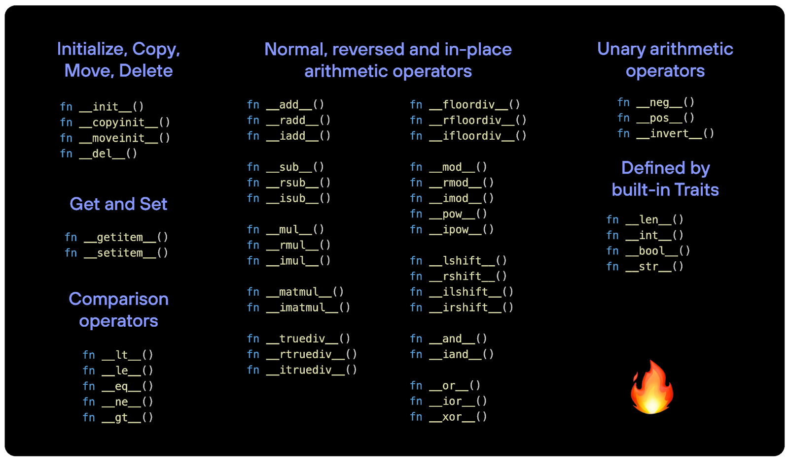

# dunder 双下划线方法 | 魔法方法 magic methods 

dunder双下划线方法 |魔法方法 magic methods | 特殊方法 Special methods： 用于定义对象在特定情况下的行为。方法名以 **`__`** 双下划线开始和结束，这类方法一般不需要我们手动调用，在满足某个条件的时候会自动调用，为对象提供了“魔法般”的功能。

大致可以分成6类：

1. 初始化、复制、移动、删除

2. Getters和Setters：`obj[idx]`，`obj[idx]=val`
3. 一元算术运算符：`-obj`、`+obj`、`~obj`
4. 比较运算符：`<`，`<=`，`==`，`~=`，`>`，`>=`
5. 常规、反向和原地**算术运算符**：`+`、`-`、`*`、`@`、`/`、`//`、`%`、`**`、`<<`、`>>`、`&`、`|`，`^`
6. 内置Traits定义的：`len(obj)`，`int(obj)`，`str(obj)`，`...`

