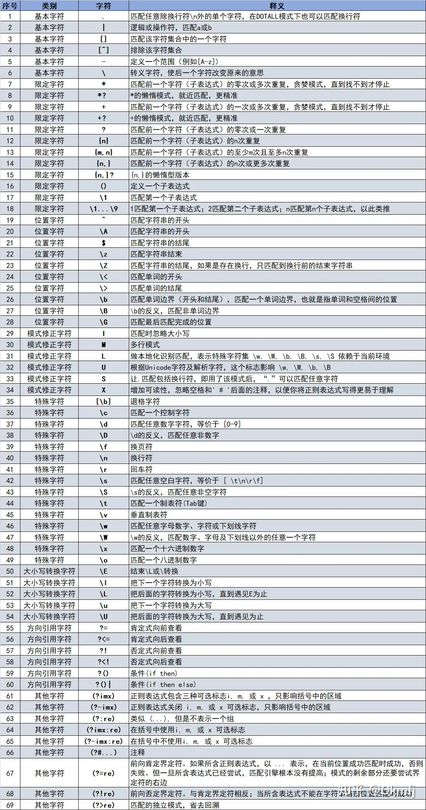

python标准库自带的`re`模块提供了类似perl的正则表达式匹配方法，通过`import re`导入。

正则表达式是由基本字符、限定字符、位置字符、模式修正字符、特殊字符、大小写转换字符、方向引用字符、其他字符等构造出来的一种字符串。各种字符的类别、释义如下表所示。

### `re`常用函数
- `re.match(pattern, string, flags=0) -> Match`: 是**从头开始匹配**的，而且是匹配到一个就返回，后面的就不会再尝试匹配了；如果字符串开头不满足正则表达式，就不会匹配成功，如果匹配不到就会返回`None`。如果你想从 string 的任意位置开始匹配，要用 `search()`。
- `re.search(pattern, string, flags=0) -> Match`: 和match()差不多，不同的就是可以不从头开始匹配，可以**从string的任意位置开始尝试匹配**，只要匹配到一个结果就结束。匹配不到就会返回`None`。

- `re.sub(pattern, repl, string, count=0, flags=0) -> str`: 用`repl`替换满足条件的字符串

- re.findall():搜索所有满足条件的字符串
  
```python
import re

text = "DJ is  a   handsome    boy"

# 将字符串中的空格 ' ' 替换成 '-'
str1 = re.sub(r"\s+", '_', text)     # DJ_is_a_handsome_boy
# 还可以使用 lambda 指定repl， 例如：将字符串中的空格 ' ' 替换成 '[ ]'
str2 = re.sub(r'\s+', lambda m: '[' + m.group(0) + ']', text, 0) # DJ[ ]is[  ]a[   ]handsome[    ]boy
print(str1)
print(str2)

```
  


#### `group()`获取匹配的内容
在正则表达式中，通过圆括号`( )`可以创建一个或多个**分组**，分组从 **1** 开始计数。
- `group()`或者`group(0)` 获取整个匹配的内容
- `group(1)` 获取第一个分组的内容(第一个括号)
- `group(n)` 获取第n个分组的内容(第n个括号)
- 如果正则表达式返回的是`None`，没有匹配成功，使用`group()`会报错

```python
import re

# 用 ( ) 创建了 3个分组
pattern = r'(\d{4})-(\d{1,2})-(\d{1,2})'   # 匹配日期格式  yyyy-mm-dd 或者 yyyy-m-d
date_string = '今天是 2024-05-8'

match = re.search(pattern, date_string)

if match:
    print("整个匹配的内容:", match.group())   # group()获取整个匹配的内容 2024-05-8
    
    print("年:", match.group(1))    # 第一个分组的内容 2024
    print("月:", match.group(2))    # 第二个分组的内容 05
    print("日:", match.group(3))    # 第三个分组的内容 8
else:
    print("没有匹配的内容")
```

### flags 标志
- re.I (re.IGNORECASE): 忽略大小写
- re.M (re.MULTILINE): 多行模式，改变 `^` 和 `$` 的行为。 
  - 在默认情况下，`^` 只匹配字符串的开头，而`$`只匹配字符串的末尾和紧接在字符串末尾（可能存在的）换行符之前。
  - 在指定` re.M`之后， `^` 将匹配字符串的开始和每一行的开头（紧随在换行符之后）； `$` 将匹配字符串的末尾和每一行的末尾（紧接在换行符之前）。
- re.S (re.DOTALL): 默认 `.` 将匹配除去换行符以外的任意字符。在指定 `re.S `后，`.`将匹配任意字符，包括换行符；
- re.X (re.VERBOSE): 详细模式。这个模式下正则表达式可以写成多行，表达式中的空白符会被忽略，并可以加入注释。例如下面2个正则表达式是一样的。


### 正则表达式
